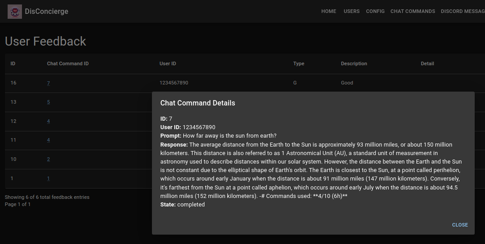
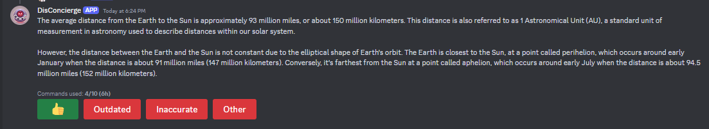
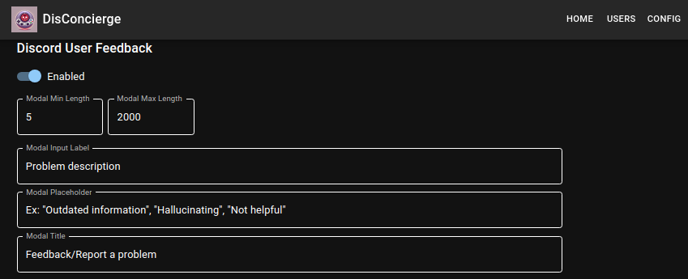

# DisConcierge

DisConcierge is a Discord bot that allows users to interact with
OpenAI assistants via Discord slash commands. It also features a
web-based admin interface for configuration and monitoring.

## Features

- Discord slash commands (`/chat` and `/private`) to interact with your OpenAI assistant
- Web-based admin interface for configuration and monitoring
- User-specific settings and rate limiting (command limits per 6 hours)
  and the ability to prioritize/ignore specific users.
- Feedback system for user responses (Discord message components that allow
  users to indicate the bot's response was good/outdated/inaccurate, or to
  provide specific feedback via text modal)
- Configurable logging levels (adjustable "live" - no restart required)
- Database logging of OpenAI API calls and Discord interactions
- Support for both **SQLite** and **PostgreSQL** databases (*Note*: SQLite
  is the default, and most tested. PostgreSQL support is experimental)


## Prerequisites

- Go 1.22 or later
- Node.js 22 or later (for building the frontend)
- Discord Bot Token and Application ID. These can be found in the [Discord dev portal](https://discord.com/developers/applications)
  under your bot, in 'General Information' (application ID) and 'Bot' (token)
- OpenAI API Token and Assistant ID (assistant IDs can be found in the
  [playground](https://platform.openai.com/playground/assistants) under 'Assistants', 
  under the "Name" field of your assistant)

## Configuration

DisConcierge is primarily configured through environment variables, or
`.env` files (by default `.env` in the current directory, or you can
specify one with `--config foo.env`).

Example dotenv (also see [`.env.example`](./.env.example)):

```env
# General/database config

DC_DATABASE=/home/foo/disconcierge.sqlite3
DC_DATABASE_TYPE=sqlite
DC_DATABASE_LOG_LEVEL=INFO
DC_DATABASE_SLOW_THRESHOLD=200ms
DC_LOG_LEVEL=INFO
DC_STARTUP_TIMEOUT=30s
DC_SHUTDOWN_TIMEOUT=60s
DC_DEVELOPMENT=true

# In-memory ChatCommand queue config

DC_QUEUE_SIZE=100
DC_QUEUE_MAX_AGE=3m
DC_QUEUE_SLEEP_EMPTY=1s
DC_QUEUE_SLEEP_PAUSED=5s

# OpenAI config

DC_OPENAI_TOKEN=your-assistant-token
DC_OPENAI_LOG_LEVEL=INFO
DC_OPENAI_ASSISTANT_ID=asst_foo

# Discord bot config

DC_DISCORD_TOKEN=your-discord-bot-token
DC_DISCORD_APPLICATION_ID=your-discord-bot-app-id
DC_DISCORD_GUILD_ID=
DC_DISCORD_LOG_LEVEL=WARN
DC_DISCORD_DISCORDGO_LOG_LEVEL=WARN
DC_DISCORD_STARTUP_MESSAGE="I'm here!"
DC_DISCORD_GATEWAY_INTENTS=3243773

# Discord webhook server

DC_DISCORD_WEBHOOK_SERVER_ENABLED=false
DC_DISCORD_WEBHOOK_SERVER_LISTEN=127.0.0.1:5001
DC_DISCORD_WEBHOOK_SERVER_SSL_CERT_FILE=/etc/ssl/cert.pem
DC_DISCORD_WEBHOOK_SERVER_SSL_KEY_FILE=/etc/ssl/cert.key
DC_DISCORD_WEBHOOK_SERVER_SSL_TLS_MIN_VERSION=771
DC_DISCORD_WEBHOOK_SERVER_LOG_LEVEL=INFO
DC_DISCORD_WEBHOOK_SERVER_PUBLIC_KEY=your_discord_public_key_here
DC_DISCORD_WEBHOOK_SERVER_READ_TIMEOUT=5s
DC_DISCORD_WEBHOOK_SERVER_READ_HEADER_TIMEOUT=5s
DC_DISCORD_WEBHOOK_SERVER_WRITE_TIMEOUT=10s
DC_DISCORD_WEBHOOK_SERVER_IDLE_TIMEOUT=30s

# API server

DC_API_LISTEN=127.0.0.1:5000
DC_API_EXTERNAL_URL=https://127.0.0.1:5000
DC_API_SSL_CERT_FILE=/etc/ssl/cert.pem
DC_API_SSL_KEY_FILE=/etc/ssl/key.pem
DC_API_SSL_TLS_MIN_VERSION=771
DC_API_SECRET=your-api-secret
DC_API_LOG_LEVEL=INFO
DC_API_CORS_ALLOW_ORIGINS=https://127.0.0.1:5000 https://localhost:5000
DC_API_CORS_ALLOW_METHODS=GET POST PUT PATCH DELETE OPTIONS HEAD
DC_API_CORS_ALLOW_HEADERS=Origin Content-Length Content-Type Accept Authorization X-Requested-With Cache-Control X-CSRF-Token X-Request-ID
DC_API_CORS_EXPOSE_HEADERS=Content-Type Content-Length Accept-Encoding X-Request-ID Location ETag Authorization Last-Modified

DC_API_CORS_ALLOW_CREDENTIALS=true
DC_API_CORS_MAX_AGE=12h
DC_API_READ_TIMEOUT=5s
DC_API_READ_HEADER_TIMEOUT=5s
DC_API_WRITE_TIMEOUT=10s
DC_API_IDLE_TIMEOUT=30s
DC_API_SESSION_MAX_AGE=6h
```

Here's a list of all configuration options that can be specified
as environment variables (* = required):

### Database Configuration

- *`DC_DATABASE_TYPE`: Database type (`sqlite` or `postgres`)
- *`DC_DATABASE`: Database connection string or file path
- `DC_DATABASE_SLOW_THRESHOLD`: Duration threshold for identifying slow database queries (default: "200ms")

### Discord Configuration

- *`DC_DISCORD_TOKEN`: Discord bot token
- *`DC_DISCORD_APPLICATION_ID`: Discord application ID
- `DC_DISCORD_GUILD_ID`: Discord guild ID for registering commands (leave empty for global commands)
- `DC_DISCORD_LOG_LEVEL`: Log level for Discord operations
- `DC_DISCORDGO_LOG_LEVEL`: Log level for the DiscordGo library
- `DC_DISCORD_GATEWAY_INTENTS`: Set the gateway intents for the bot (default: 3243773)

### OpenAI Configuration

- *`DC_OPENAI_TOKEN`: OpenAI API token
- *`DC_OPENAI_ASSISTANT_ID`: OpenAI Assistant ID
- `DC_OPENAI_LOG_LEVEL`: Log level for OpenAI operations

### API Server Configuration

- *`DC_API_LISTEN`: API server listen address (default: ":5000")
- `DC_API_EXTERNAL_URL`: External URL for the API server. This is used in the
  admin interface, and may be used by the bot to provide links to the admin
  interface via Discord, if a notification channel is set.
- `DC_API_SECRET`: Secret used to sign API session cookies
- `DC_API_SSL_CERT_FILE`: Path to SSL certificate file
- `DC_API_SSL_KEY_FILE`: Path to SSL key file
- `DC_API_LOG_LEVEL`: Log level for API operations
- `DC_API_SESSION_MAX_AGE`: Max age for session cookies (default: "6h")

### CORS Configuration

- `DC_API_CORS_ALLOW_ORIGINS`: Allowed origins for CORS
- `DC_API_CORS_ALLOW_METHODS`: Allowed methods for CORS
- `DC_API_CORS_ALLOW_HEADERS`: Allowed headers for CORS
- `DC_API_CORS_EXPOSE_HEADERS`: Headers to expose for CORS
- `DC_API_CORS_ALLOW_CREDENTIALS`: Allow credentials for CORS (default: true)
- `DC_API_CORS_MAX_AGE`: Max age for CORS preflight requests (default: "12h")

### Queue Configuration

- `DC_QUEUE_SIZE`: Maximum queue size for chat commands
- `DC_QUEUE_MAX_AGE`: Maximum age of a request in the queue
- `DC_QUEUE_SLEEP_EMPTY`: Sleep duration when the queue is empty
- `DC_QUEUE_SLEEP_PAUSED`: Sleep duration when the bot is paused

### Miscellaneous Configuration

- `DC_LOG_LEVEL`: General log level for the application
- `DC_STARTUP_TIMEOUT`: Timeout for application startup
- `DC_SHUTDOWN_TIMEOUT`: Timeout for graceful shutdown
- `DC_DEVELOPMENT`: Enable development mode (default: false). Sets SameSite=None for session cookies.

## Running the Application

### Using Docker

1. Build the Docker image:
   ```shell
   docker build -t disconcierge .
   ```

2. Run the container:
   ```
   docker run -p 5000:5000 -v /path/to/data:/data \
     -e DC_DISCORD_TOKEN=your_discord_token \
     -e DC_DISCORD_APPLICATION_ID=your_app_id \
     -e DC_OPENAI_TOKEN=your_openai_token \
     -e DC_OPENAI_ASSISTANT_ID=your_assistant_id \
     -e DC_API_SECRET=your_api_secret \
     disconcierge
   ```

### Build+Run Binary

Both the bot's backend and frontend compile to a single binary.
To compile, just run:

```shell
$ make all
```

Set the required environment variables (either via export or
by dotfile, by default `.env` in your current directory) as described above.

Then, create the database and set your admin credentials, followed by
running the bot:

```shell
$ ./bin/disconcierge init
 ...
$ ./bin/disconcierge run
```

## Usage

Once the bot is running and invited to your Discord server (or installed 
as a user app), you can interact with it using the following slash commands:

- `/chat`: Start a conversation with the bot
- `/private`: The same as `/chat`, but only the user invoking it can
  see their message and the bot's response where they're executing it (ephemeral response).
  The message/response is still logged in your configured DB by default.
- `/clear`: Clears the conversation history / starts a new thread

Access the admin interface by navigating to `https://your-server:5000/disconcierge` in your web browser.

**Note**: If your slash commands aren't showing up in Discord (after restarting
your client), you may need to register them again. This can be done in the
admin interface under "Actions" -> "Register Discord Commands".

## User Feedback System

DisConcierge implements a user feedback system for your OpenAI assistant's responses, 
via Discord message components (buttons and modals), allowing users to provide 
either quick feedback or more detailed feedback via a modal dialog.

User feedback is visible in the admin interface at `/disconcierge/user_feedback`
(ex: `https://localhost:5000/disconcierge/user_feedback`), linked to the user's Discord ID
and the `/chat` (or `/private`) command that was used:




### Feedback Options

After each `/chat` or `/private` response (assuming the command succeeded), 
users are presented with the following feedback options:

1. **Good**: Indicates the response was satisfactory.
2. **Outdated**: Suggests the information provided is not up-to-date.
3. **Inaccurate**: Indicates the response contains errors or hallucinations.
4. **Other**: Allows users to provide custom feedback via a modal dialog.


### Feedback Behavior

- Feedback buttons are visible to all users in the channel, unless using
  `/private` or using `/chat` in a DM to the bot.
- Multiple users can provide feedback on the same response.
- Feedback is stored individually for each user who responds.
- When a user clicks a feedback button, a number on the button will increment
  to confirm it was received, and to indicate the  number of users who have 
  selected that feedback option. Selecting a button more than once has no
  effect. The exception to this rule is the "*Other*" button, which allows
  a user to provide detailed feedback. The *Other* button will only be incremented
  when the modal is submitted, and users can use this button multiple times.

### Example Screenshots

In a "private" interaction (either via `/private` or using
`/chat` in a DM to the bot) this is the initial state of the feedback buttons:



After clicking the feedback buttons, the labels are incremented to show
the number of users who have selected that feedback option:


**Note**: Feedback buttons can be disabled entirely via the admin interface,
on the config page, under the *Discord User Feedback* section:



## Database Activity Logs

DisConcierge maintains logs of interactions, activities, API calls, etc., in
the database you specify.

These provide some insight into the bot's operation and usage, including user 
interactions, errors, OpenAI API calls being made (token usage, run steps, etc.), 
and more.

This generally helps with debugging, monitoring, and auditing the bot's behavior,
or Discord/OpenAI behavior (such as if OpenAI runs are suddenly failing, or if
Discord interaction acknowledgments are timing out).

This *especially* helps if you're tweaking the assistant's instructions,
the files provided to the assistant, etc., and need to see whether the
bot has had a change in feedback (such as users suddenly indicating
responses are inaccurate or outdated).

Here's an overview of what's logged:

### Discord Interactions

- `discord_messages`: Logs specific Discord messages that mention the bot, 
  reply to the bot's interactions, or reference the bot's known slash commands. 
  Includes message content, user details, and context. This can be helpful to
  determine if users are trying to @mention the bot to use it instead of
  using the slash commands. These are available in the admin interface.
- `interaction_logs`: Records all Discord interactions with the bot, including 
  slash commands and button clicks. Captures interaction type, user info, and payload data.
  This can be helpful to debug errors in slash commands or button interactions that
  encounter errors.
- `chat_commands`: Logs details of `/chat` and `/private` slash command executions, 
  including user prompts, bot responses, and processing metadata. The processing
  metadata allows the bot to pick up where it left off if it was interrupted
  while processing a command. Discord interactions where the token has expired
  will not be resumed, to avoid unnecessary token usage for interactions the
  bot wouldn't be able to respond to anyway. This makes it safe to restart the
  bot without abandoning in-progress interactions.
- `clear_commands`: Tracks executions of the `/clear` slash command, 
  recording when users reset their conversation with the assistant. Also tracks
  errors.
- `user_feedback`: Records user feedback on the bot's responses, including 
  feedback type (good, bad, outdated, inaccurate, other), user details, 
  and the associated chat command.

### OpenAI API Interactions

- `openai_create_thread`: Logs the creation of new conversation threads in the OpenAI API.
- `openai_create_message`: Records when new messages are added to OpenAI conversation threads.
- `openai_create_run`: Logs the initiation of new runs (executions) in the OpenAI API.
- `openai_retrieve_run`: Tracks retrievals of run status and results from the OpenAI API.
- `openai_list_messages`: Records requests to list messages in an OpenAI conversation thread.
- `openai_lits_run_steps`: Logs requests to list the steps of a specific run in the OpenAI API.

### Accessing Logs

Some of these records are currently available in the admin interface, while some
are currently only available directly in the database.

## Scaling/Multiple Instances / Webhook Support

For larger applications or scenarios requiring scalability, DisConcierge supports receiving
interactions via Discord webhooks. This can be used to run multiple instances of the same bot.
It's important to note that DisConcierge does *not* currently support sharding via Gateway connections.

If you just want to use webhooks instead of the gateway connection, that's
cool too, just worry about the certs/configuration (although the bot won't appear online in Discord).

The gist of the process:

1. Configure your Discord application to use webhooks for interactions in the Discord dev portal
2. Set up your environment to route Discord webhook requests to your DisConcierge instance(s)
3. Configure your instance(s) so they can handle+validate webhook requests
4. If you're running multiple instances of the same bot, **use a PostgreSQL database**.
   SQLite only supports a single writer at a time, and you know it!

### Configuration

The DisConcierge webhook server can be enabled/configured via environment variables, or `.env` files.
**Note**: The webhook server is disabled by default, and runs on a separate port from
the backend API server.

```shell
DC_DISCORD_WEBHOOK_ENABLED=true
DC_DISCORD_WEBHOOK_LISTEN=127.0.0.1:5001
DC_DISCORD_WEBHOOK_SSL_CERT_FILE=/etc/ssl/cert.pem
DC_DISCORD_WEBHOOK_SSL_KEY_FILE=/etc/ssl/cert.key
DC_DISCORD_WEBHOOK_PUBLIC_KEY=your_discord_bot_public_key
DC_DISCORD_TOKEN=your_discord_token
DC_DISCORD_APPLICATION_ID=your_discord_application_id
DC_DISCORD_GUILD_ID=optional_discord_guild_id
```

### Considerations/Caveats for Multiple Instances

If you plan to run multiple instances of DisConcierge for the same Discord bot,
there are a few things to keep in mind.
 
#### Use PostgreSQL

Use a **PostgreSQL** database rather than SQLite.

**SQLite doesn't support multiple writers, and you know it**

**ಠ_ಠ**

#### Configuration Updates

Configuration updates may not immediately propagate across all instances. 
This is because each instance maintains a cache of its (database-backed) runtime 
configuration and user list. By default, the cache is refreshed every 5 minutes, and, when using postgres,
updating the configuration in the UI emits a `LISTEN/NOTIFY` signal to all instances, which
triggers an immediate refresh.

#### Load Balancing

Use a load balancer to distribute incoming webhook requests across your DisConcierge instances.

#### Bot Status

The bot's online/offline and any custom status is set via the
Discord gateway. If the bot's gateway connection is enabled, then each instance
will set the bot's status independently as they connect. However, an update 
via the admin interface _should_ only trigger a single update from the instance receiving 
the update. If you disable the gateway connection, you avoid that scenario.
Alternatively, you could run a single, separate instance with
the gateway connection enabled to manage the bot's status (though this would require
a separate database for its configuration).

#### User command concurrency

By default, an instance of the bot will only allow
a user to run a single slash command at a time (similar to how ChatGPT requires you
to wait until it's done before you can send another message). If you have multiple instances,
a user can potentially run as many commands concurrently as you have instances
(a subsequent command will only be rejected if it's routed to an instance that's
already running a command for that same user). This potentially allows a user
to exceed their 6-hour rate limit, as commands only count against that limit
when they complete, or indicate token usage. (If a user is limited to
10 `/chat` commands per 6 hours, and you have 20 instances, they could potentially
run 20 concurrent `/chat` commands, as they wouldn't yet be counted against the
rate limit).

That said, the actual behavior in this case may be unpredictable, because
the OpenAI assistant API, while a run is in progress, is supposed to prevent
new messages from being added to existing threads, and prevent new runs from
being created for the thread.


#### OpenAI API Rate Limiting

The bot's internal rate limiter on the number
of "Create Run" requests it can make per second via the OpenAI API is
per-instance. If you set this limit at 1 request/second, and you have 10
instances, that's an effective limit of 10 requests/second. To maximize
this limit, set it according to your OpenAI API plan's rate limits and
your number of instances.

Also keep in mind that the bot currently maintains an in-memory cache of all users,
which is loaded on startup and is periodically refreshed. This sets an upper limit on the 
number of users the bot can handle before encountering potential issues with database
latency during refreshes. Later on, support for a distributed cache (like Redis) may be added,
but until such a need arises, it's a bit overkill.
